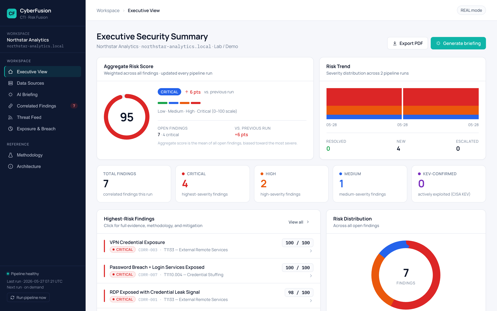
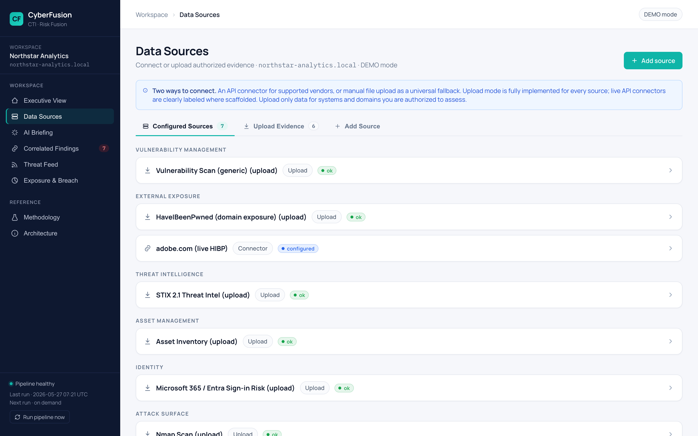
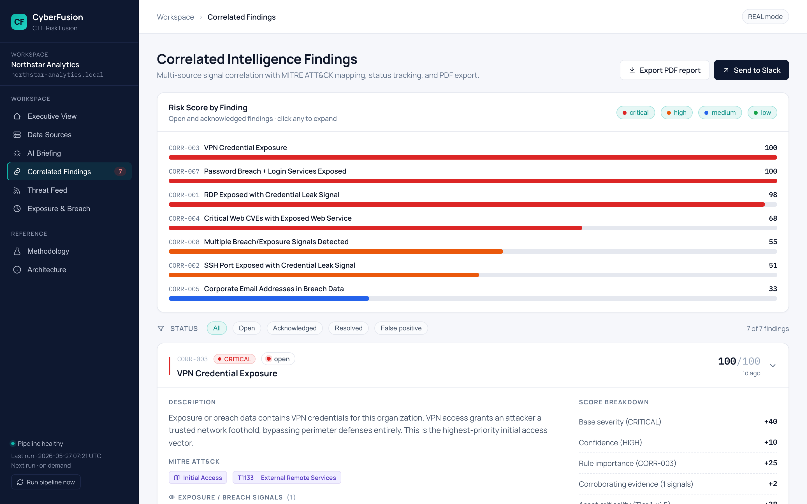
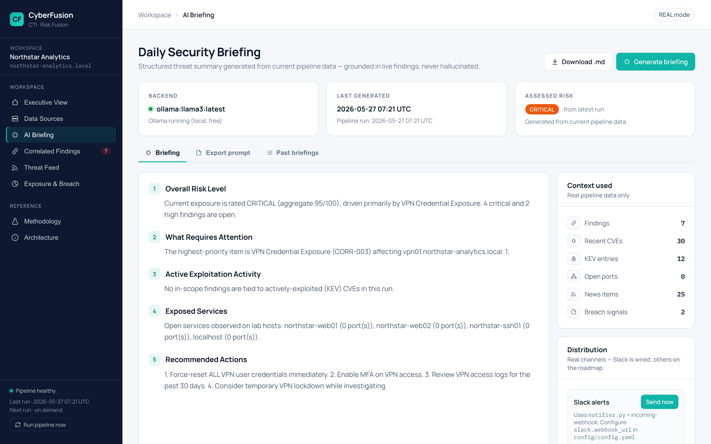
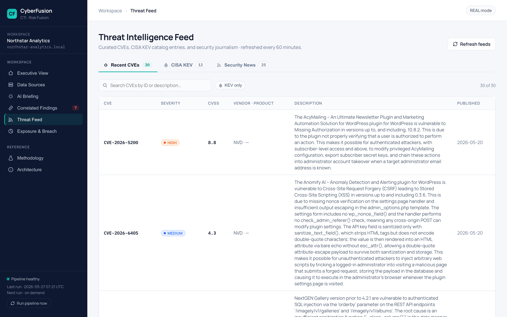
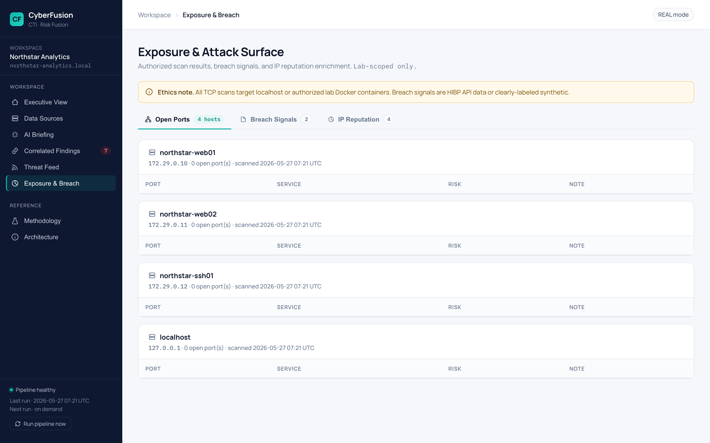
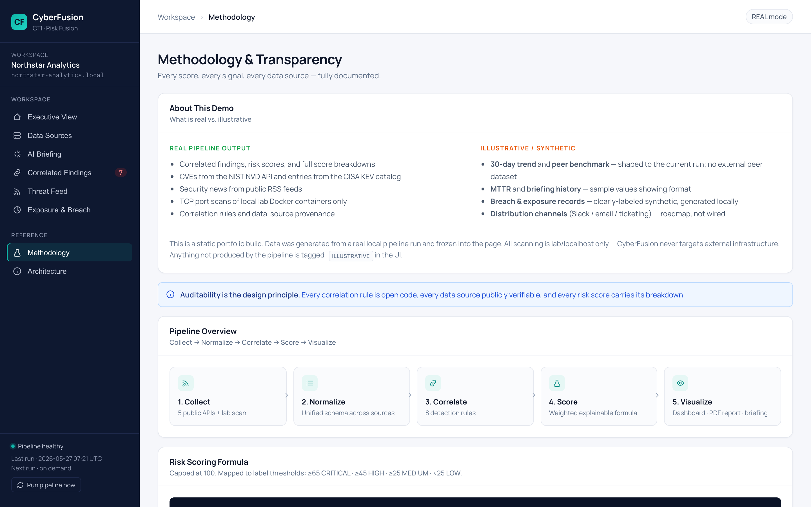

# CyberFusion

A side project I've been building to learn how threat intelligence platforms actually work. It pulls in CVE data, scan results, breach exports, and asset inventories, normalizes them, runs correlation rules, and gives you a prioritized list of what to look at. The idea is to do what tools like Tenable or Recorded Future do at a smaller scale, with everything explainable so you can see exactly why something got flagged.

It's a React frontend on a FastAPI backend, sitting on top of a Python pipeline. Single server in production, two in dev.

**Live demo:** https://SStevenB.github.io/cyberfusion-complete/ (static snapshot, real pipeline data)



## What it actually does

You upload security evidence (or connect an API like HaveIBeenPwned), the pipeline parses it, and an analysis layer correlates signals across sources. The result is a ranked list of findings, each with a score breakdown showing why it ranked where it did. Severity, asset criticality, KEV cross-reference (CISA's known-exploited list), evidence count — they all feed in, and you can see each one's contribution.

I built this because the explainability part interests me. Most security tools give you a number with no defense, and analysts end up second-guessing them. Here every score is reproducible.

## Screenshots

The Data Sources page — configure connectors, upload files, see the live HIBP connector pulling real breach data:



Findings with full evidence trails and status tracking:



The briefing page generates a structured CISO-style summary. If you have Ollama running locally it uses llama3 for free; otherwise it falls back to a template grounded in current findings:



<details>
<summary>A few more — threat feed, exposure, methodology</summary>





</details>

## Running it

You need Python 3.11+ and Node 22+. First time:

```bash
git clone https://github.com/SStevenB/cyberfusion-complete.git
cd cyberfusion-complete
python3 -m venv venv && source venv/bin/activate
pip install -r requirements.txt
cd frontend && unset NODE_ENV && npm install --include=dev && npm run build && cd ..
```

Then just `./start.sh` and open http://localhost:8000. The launcher activates the venv, frees the port if something's already there, and starts the server. Press Ctrl+C to stop.

If you want the AI briefing to actually use AI instead of the template fallback, run `./start_ollama.sh` once in another terminal — it pulls llama3 (~4.6 GB, one-time) and starts a local LLM server. Free, runs offline.

Dev mode (hot reload on the frontend) is two terminals:
```bash
uvicorn api.main:app --reload --port 8000           # terminal 1
cd frontend && unset NODE_ENV && npm run dev        # terminal 2 — opens :5173 with /api proxy
```

## What's inside

```
api/main.py                    FastAPI — wraps the pipeline as REST endpoints
frontend/                      Vite + React SPA, served from /api/main.py in prod
analysis/                      normalizer, correlator (8 rules → MITRE), risk scorer, history
ingestion/                     parsers (nmap, vuln CSV, asset, HIBP, M365, STIX) + connectors
data_collection/               NVD, CISA KEV, RSS, breach, IP reputation collectors
scanning/scanner.py            TCP scanner (lab/localhost only — never external)
samples/                       Synthetic evidence files for the demo
tests/                         78 pytest tests
run_pipeline.py                The pipeline orchestrator
build_demo.py                  Builds the static GitHub Pages snapshot
```

## Data sources

Everything pulls from public APIs or files you provide. Nothing requires a paid account to run, though some connectors get richer with optional free keys.

| Source | Provides | Key |
|--------|----------|-----|
| NIST NVD | CVE records | none |
| CISA KEV | Actively-exploited CVE catalog | none |
| RSS feeds | Krebs, BleepingComputer, Hacker News | none |
| Shodan InternetDB | IP exposure context | none (free) |
| GreyNoise | Scanner/noise classification | free key |
| HaveIBeenPwned | Domain breach history | optional |

## Connectors

There's a connector layer in `ingestion/connectors/` for Tenable, Qualys, HIBP, M365/Entra, and STIX/TAXII. Only **HIBP is wired to a live vendor API** — it hits the free `/breaches?domain=` endpoint and returns real breach records (try `adobe.com` and you'll see the 2013 dump with 152M accounts).

The other four are honestly labeled "scaffolded" in the UI. Their config screens work, the connection-test endpoints work, but I haven't wired their live fetch because that needs paid vendor accounts I don't have. CSV upload mode works fully for every source as a universal fallback. The "Sync now" button only shows up on connectors that are actually implemented — I went out of my way to keep this distinction visible in the UI instead of faking it.

## Honest about what's real

A few things on the dashboard are clearly tagged in the methodology page rather than left ambiguous:

- **Findings, scores, CVEs, KEV cross-refs, ports** — all real pipeline output, regenerated every run
- **Run-over-run trend** — accumulates as you run the pipeline; with one run it says so
- **Breach data** — synthetic when no HIBP key is configured (and labeled as such)
- **Briefing distribution** — Slack is real (uses `notifier.py` if you set a webhook); email and Jira are roadmap and labeled accordingly

The whole point of a security tool is trust, so I figured fake numbers in a portfolio version would defeat the purpose.

## Ethics

Scans only run against localhost or Docker lab containers. The scanner won't accept external targets. Synthetic data is identified in code comments and in the UI. Real credentials never get stored in the repo — connector secrets go to the OS keychain via `keyring`, with a gitignored local file as the fallback for headless environments.

## Tests

```bash
source venv/bin/activate
pytest tests/ -q
```

78 tests covering the pipeline, ingestion, source registry, secrets, connectors, the FastAPI endpoints, and the trend history. They use isolated temp workspaces so they don't touch your real state.

## Deploying

There's a `Dockerfile`, `render.yaml`, and `build.sh` for Render/Fly/Railway. Details in [DEPLOY.md](DEPLOY.md). Short version: Render reads `render.yaml`, runs `./build.sh`, and serves a single uvicorn process that handles both the API and the built React app.

## License

MIT.
